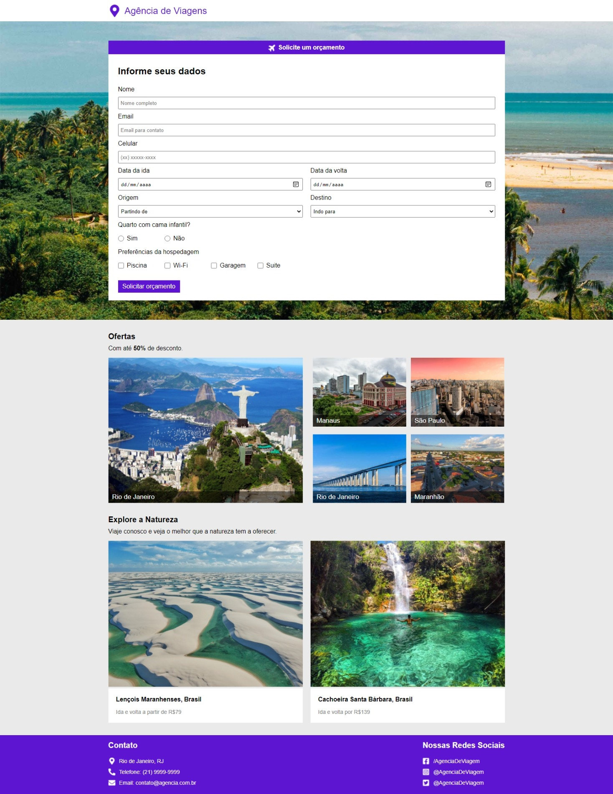

<h1>Agência de Viagens</h1>
<h2>Projeto:</h2>

A proposta desse projeto é criar o front-end de uma página web dinâmica utilizando formulários para enviar dados do front-end para o back-end.

<h3>Seções:</h3>

1. Topo
2. Conteudo Principal:
    - Formulário
        - Backend foi desenvolvido por outros devs.
        - Aqui criaremos apenas o Frontend da aplicação.
    - Ofertas
    - Anuncios
3. Rodapé

<h4>OBS:</h4>

- HTML -> Estrutura da Pagina
- CSS -> Estilização da Pagina

    * Incluindo 'Responsividade'

<h2>Layouts</h2>

<h4>OBS: Os outros Layouts estão na pasta 'layouts' no repositório.</h4>

<ul>
    <caption>
        <h3>Tecnologias utilizadas:</h3>
    </caption>
    <li>Html Semântico</li>
    <li>CSS</li>
    <li>Flexbox</li>
    <li>Resposividade</li>
    <li>Efeitos visuais</li>
    <li>Formulários (Front-End)</li>
    <li>Validação de regras de negócios</li>
    <li>Editor de código: VSCode</li>
</ul>

<h3> Desenvolvido por: <a href="https://www.linkedin.com/in/montemarcos/" target="_blank">Marcos Monte</a></h3>
